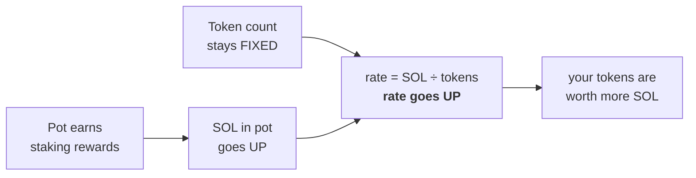
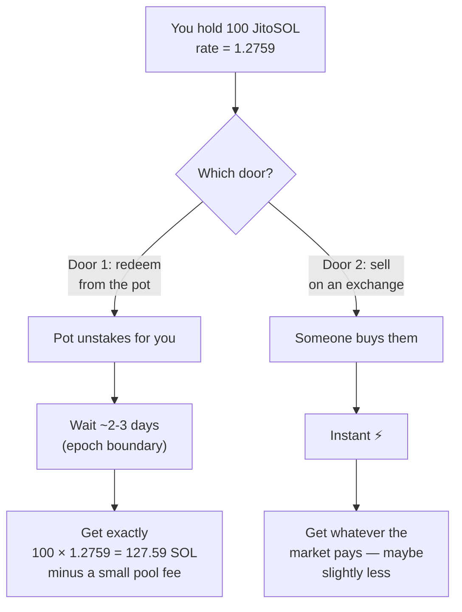

# The Slow Lane

**Staking rewards, LSTs, and all the math — explained very slowly.**

This is a companion to [`GUIDE.md`](./GUIDE.md). It re-teaches the middle of that
guide (Part 1.3 through Part 3) at about a quarter of the speed, with the
arithmetic fully written out.

Nothing here assumes you remember the other file. Start fresh.

**How to use this:** every section ends with a *Check yourself* box. Try it before
you open the answer. If you can do those, you understand it — not "sort of
understand it", actually understand it.

---

## Contents

- [Chapter 0: The three numbers](#chapter-0-the-three-numbers)
- [Chapter 1: Where the reward money comes from](#chapter-1-where-the-reward-money-comes-from)
- [Chapter 2: Commission](#chapter-2-commission-someone-takes-a-cut)
- [Chapter 3: The catch — your SOL is frozen](#chapter-3-the-catch--your-sol-is-frozen)
- [Chapter 4: The shared pot](#chapter-4-the-shared-pot-this-is-the-big-one)
- [Chapter 5: Reading an exchange rate](#chapter-5-reading-an-exchange-rate)
- [Chapter 6: The scary formula](#chapter-6-the-scary-formula)
- [Chapter 7: Getting your money out](#chapter-7-getting-your-money-out)
- [Chapter 8: When things go wrong](#chapter-8-when-things-go-wrong)
- [Chapter 9: The seven kinds of LST](#chapter-9-the-seven-kinds-of-lst)
- [Chapter 10: Counting spread properly](#chapter-10-counting-spread-properly)
- [Chapter 11: Percent vs points](#chapter-11-percent-vs-points)
- [Cheat sheet](#cheat-sheet)
- [Common confusions](#common-confusions)

---

# Chapter 0: The three numbers

Before anything else. If percentages are shaky, everything downstream is shaky,
so let's be completely explicit.

**"4% of 10 SOL"** means:

```
4% = 4 per hundred = 4/100 = 0.04

0.04 × 10 SOL = 0.4 SOL
```

**To take 4% off something**, you keep the other 96%:

```
Keep = 100% − 4% = 96% = 0.96

10 SOL × 0.96 = 9.6 SOL
```

That second one — multiplying by `(1 − the percentage)` — shows up constantly
from here on. Whenever you see something like `× (1 − 0.04)`, it just means
"after a 4% cut is taken".

**One more:** a **basis point** (bp) is one hundredth of a percent.

```
100 bps = 1%
400 bps = 4%
700 bps = 7%
```

Blockchain APIs love basis points, and people misread them constantly. Helius's
own staking page currently prints `700` as **"700.00%"** when it means **7%**.
Same digits, off by a factor of 100.

<details>
<summary><b>Check yourself</b> — A validator takes 7%. You earn 20 SOL of rewards before their cut. How much do you keep?</summary>

```
Keep 100% − 7% = 93% = 0.93
20 × 0.93 = 18.6 SOL
```
(Or: their cut is 0.07 × 20 = 1.4, and 20 − 1.4 = 18.6. Same thing.)
</details>

---

# Chapter 1: Where the reward money comes from

## 1.1 Somebody has to run the computers

Solana is ~1,300 independent computers, called **validators**, that take turns
writing down transactions and checking each other's work. That's a real job with
real costs, so they need to be paid.

## 1.2 The payment is newly created SOL

Here's the part that surprises people: **the reward money doesn't come from
fees paid by users.** Not mostly. It comes from the network *printing new SOL*.

This is called **inflation**.

```
Every ~2.5 days, the network creates a batch of brand-new SOL
and hands it out to everyone who has staked.
```

Right now that works out to about **4.40% per year**. So if the whole network
had 100 SOL staked, after a year there'd be about 104.40 SOL.

## 1.3 Why "free money" is the wrong way to think about it

Imagine a pizza cut into 100 slices. You own 1 slice — **1% of the pizza**.

Now the pizza-maker adds 4 more slices and hands them out **only to people
who showed up to collect**.

**If you showed up (you staked):**

```
Before:  you have 1 slice   of 100 →  1.00%
You collect your share of the 4 new slices → you now have ~1.04 slices
After:   you have 1.04      of 104 →  1.00%   ← unchanged
```

**If you didn't show up (you didn't stake):**

```
Before:  you have 1 slice   of 100 →  1.00%
After:   you have 1 slice   of 104 →  0.96%   ← you shrank
```

```
        Didn't stake              Staked
        ────────────              ──────
 share  1.00% ──▼── 0.96%         1.00% ──── 1.00%
        you lost ground           you held your place
```

So staking is **mostly defensive**. You're not getting richer relative to
everyone else; you're avoiding getting poorer. People who describe staking yield
as "free money" have this backwards.

> **Take-away #1:** Not staking is a slow, silent cost.

## 1.4 Everybody gets the same base rate

The new SOL is split **in proportion to how much you staked**. That's it. There's
no bidding, no bonus for choosing a clever validator.

```
Alice staked 100 SOL ──┐
Bob   staked 200 SOL ──┼──►  new SOL split 100 : 200 : 700
Carol staked 700 SOL ──┘      (Carol gets 7× Alice, because she staked 7× more)
```

This has a consequence that kills a lot of marketing:

> **Take-away #2:** No validator, and no LST, can pay you meaningfully more
> *base* yield than another. It's the same pot, split by size. If something
> advertises 9%, that extra is coming from somewhere else — and you should find
> out where.

## 1.5 Payday is every ~2.5 days

Solana's clock runs in **epochs** — roughly 2–3 days each. This project uses 2.5
days, which means:

```
365 days ÷ 2.5 days per epoch ≈ 146 epochs per year
```

Rewards land at the end of each epoch. Nothing happens in between.

```
  epoch 1007        epoch 1008        epoch 1009
├─────────────────┼─────────────────┼─────────────────┤
                  ▲                 ▲                 ▲
               payday            payday            payday
              (~2.5d)           (~2.5d)           (~2.5d)
```

Remember 146. It comes back in Chapter 6.

<details>
<summary><b>Check yourself</b> — The network pays 4.40%/year. You stake 50 SOL and there's no commission. Roughly what do you have after a year?</summary>

```
50 × 0.0440 = 2.20 SOL of rewards
50 + 2.20   = 52.20 SOL
```
(Or in one step: 50 × 1.0440 = 52.20.)
</details>

---

# Chapter 2: Commission — someone takes a cut

## 2.1 The idea

Your validator does the work, so they keep a slice of the rewards flowing through
them. That slice is **commission**.

If your validator charges **4%**, then out of every 100 SOL of rewards, they keep
4 and you get 96.

## 2.2 The arithmetic, slowly

The network's gross rate is **4.40%**. Your validator charges **4%**.

**Step 1** — turn the commission into a "keep" fraction:

```
100% − 4% = 96% = 0.96
```

**Step 2** — multiply:

```
4.40% × 0.96 = 4.224%
```

**Step 3** — round for display: **4.22%**

That's the number the dashboard shows as your base rate. Written as one line:

```
your base rate = gross rate × (1 − commission)
               = 4.40%      × (1 − 0.04)
               = 4.40%      × 0.96
               = 4.22%
```

## 2.3 Seeing it in actual SOL

You stake **10 SOL** for one year:

```
Gross rewards        10 × 0.0440  = 0.4400 SOL
Validator's cut      0.44 × 0.04  = 0.0176 SOL
You keep             0.44 − 0.0176 = 0.4224 SOL
                                    ─────────
Your total           10 + 0.4224   = 10.4224 SOL
```

Notice the validator's cut is **0.0176 SOL** — 4% *of the rewards*, not 4% of
your 10 SOL. This trips up almost everyone the first time.

```
Your 10 SOL
│
├─ 10.0000 SOL  ← your original stake, untouched
│
└─  0.4400 SOL  ← rewards
     ├─ 0.4224  ← yours   (96%)
     └─ 0.0176  ← theirs  (4%)
```

## 2.4 Why this is one of the few real levers

Everyone shares the same 4.40% gross. So the *only* ways an LST can differ on
base yield are:

1. picking validators with **lower commission**, and
2. picking validators that **actually do their job** (a validator who misses
   their turns earns less to share).

That's it. This is why commission is worth caring about and why "we have the best
validators!" is usually noise.

<details>
<summary><b>Check yourself</b> — Gross is 4.40%. Validator A charges 0%, validator B charges 10%. What base rate does each deliver, and how much more is A on 1,000 SOL?</summary>

```
A:  4.40% × (1 − 0.00) = 4.40% × 1.00 = 4.40%
B:  4.40% × (1 − 0.10) = 4.40% × 0.90 = 3.96%

On 1,000 SOL:
A → 1000 × 0.0440 = 44.0 SOL
B → 1000 × 0.0396 = 39.6 SOL
Difference        =  4.4 SOL per year
```
</details>

---

# Chapter 3: The catch — your SOL is frozen

Staking directly ("native staking") has one big downside that has nothing to do
with yield.

**Your SOL is stuck.**

- You can't trade it.
- You can't use it as collateral to borrow.
- You can't put it in a liquidity pool.
- Getting it back takes until the next epoch boundary — **up to ~3 days**.

```
Day 0    You want out. You click "unstake".
         │
         │   ← your SOL is in "cooling down". You can only watch.
         │
Day ~3   Epoch boundary. Now you can move it.
```

Three days doesn't sound like much until the price drops 20% on day one.

## The whole problem in one picture

```
        STAKED                          NOT STAKED
   ┌──────────────────┐            ┌──────────────────┐
   │  earning 4.32%   │            │  earning 0%      │
   │  frozen ❄        │            │  free to use ✓   │
   └──────────────────┘            └──────────────────┘

              you had to pick one. that's the problem.
```

> **Take-away #3:** LSTs exist to give you *both* boxes at once. Everything from
> here is about how they do that and what it costs.

---

# Chapter 4: The shared pot (this is the big one)

If you understand this chapter, the rest is easy. Read it twice.

## 4.1 The setup

Instead of staking alone, a bunch of people put SOL into a **shared pot** (a
smart contract — a program on the blockchain). The pot stakes everything for
everyone. Each depositor gets **tokens that represent their share of the pot**.

Those tokens are the **LST** — the Liquid Staking Token. JitoSOL, mSOL, JupSOL
are all just "share tokens for a particular pot".

## 4.2 Day one

The pot is brand new and empty. Three people deposit.

```
      Alice 100 SOL      Bob 200 SOL      Carol 700 SOL
            │                 │                 │
            └────────────┬────┴─────────────────┘
                         ▼
              ┌────────────────────────┐
              │  THE POT               │
              │  holds 1,000 SOL       │
              │  issued 1,000 tokens   │
              └────────────────────────┘

  Alice holds 100 tokens    Bob 200 tokens    Carol 700 tokens
```

The rule the pot follows:

```
                    SOL in the pot        1,000
exchange rate  =  ─────────────────  =  ───────  =  1.0
                   tokens issued         1,000
```

**One token is worth 1.0 SOL.** Fair — everyone just deposited.

## 4.3 A year passes

The pot had all 1,000 SOL staked, earning 4.32%. So it earned **43.2 SOL**.

Now, here's the only thing you need to notice:

```
                  BEFORE            AFTER
SOL in the pot    1,000             1,043.2      ← went UP
tokens issued     1,000             1,000        ← did NOT change
                  ─────             ───────
exchange rate     1.0               1.0432       ← went UP
```

**Nobody's token count changed.** Alice still holds exactly 100 tokens. But each
token is now worth 1.0432 SOL, so her 100 tokens are worth **104.32 SOL**.



> **Take-away #4 — the single most important idea here:**
> **Your token count never changes. The exchange rate goes up. That IS the
> yield.**

## 4.4 What happens when a new person joins later

Dave shows up after that year and deposits 100 SOL. The rate is 1.0432.

How many tokens does he get? Not 100 — that would be stealing from everyone else.

```
tokens = SOL deposited ÷ current rate
       = 100 ÷ 1.0432
       = 95.86 tokens
```

Check it makes sense: 95.86 tokens × 1.0432 = 100 SOL. Dave put in 100, he owns
100. Nobody gained or lost. The rate keeps the books honest automatically.

```
             POT BEFORE DAVE          POT AFTER DAVE
SOL          1,043.20                 1,143.20
tokens       1,000.00                 1,095.86
rate         1.0432                   1.0432        ← unchanged ✓
```

That's why deposits and withdrawals don't dilute anyone.

## 4.5 Why they built it this way

The obvious alternative is to just grow everyone's balance — you hold 100 today,
100.012 tomorrow. It's easier to read.

But it **breaks DeFi**. Lending markets and liquidity pools track balances; if
balances change on their own, the accounting falls apart and most protocols
refuse to support the token.

With a fixed token count and a rising rate, an LST behaves like any ordinary
token. That's what makes it usable everywhere.

<details>
<summary><b>Check yourself</b> — A pot holds 5,000 SOL and has issued 4,000 tokens. (a) What's the rate? (b) You deposit 250 SOL — how many tokens? (c) The pot earns 200 SOL — what's the new rate?</summary>

```
(a) 5,000 ÷ 4,000 = 1.25

(b) 250 ÷ 1.25 = 200 tokens
    (pot now: 5,250 SOL, 4,200 tokens → 5,250 ÷ 4,200 = 1.25 ✓ unchanged)

(c) SOL: 5,250 + 200 = 5,450    tokens: still 4,200
    5,450 ÷ 4,200 = 1.2976
```
</details>

---

# Chapter 5: Reading an exchange rate

Four real numbers from the dashboard:

| LST | Rate | Read it as |
|---|---|---|
| BNSOL | 1.110411 | 1 BNSOL = 1.1104 SOL |
| JitoSOL | 1.275866 | 1 JitoSOL = 1.2759 SOL |
| mSOL | 1.376648 | 1 mSOL = 1.3766 SOL |
| INF | 1.407837 | 1 INF = 1.4078 SOL |

## 5.1 The trap: a higher rate is NOT a better LST

Every one of these pots started at **1.0**. So the rate tells you **how much
total yield it has ever earned**, which mostly tells you **how old it is**.

```
mSOL at 1.3766  →  has earned 37.66% since it launched
BNSOL at 1.1104 →  has earned 11.04% since it launched
```

mSOL isn't better. mSOL is **older**. BNSOL launched later and hasn't had as much
time.

```
 rate
 1.40 ┤                                          ╭─── mSOL (old)
      │                                    ╭─────╯
 1.30 ┤                              ╭─────╯
      │                        ╭─────╯
 1.20 ┤                  ╭─────╯
      │            ╭─────╯                  ╭───────── BNSOL (young)
 1.10 ┤      ╭─────╯                  ╭─────╯
      │╭─────╯                  ╭─────╯
 1.00 ┼╯───────────────────────╯
      └────────────────────────────────────────────
       both start at 1.00, just at different times

  ⚠ The HEIGHT tells you age.
  ✓ The STEEPNESS tells you yield.
```

> **Take-away #5:** Level = age. **Slope = yield.** Only the slope is worth
> comparing.

## 5.2 Buying, held, sold — the full round trip

You have **100 SOL** and buy JitoSOL at **1.275866**.

**Step 1 — how many tokens?**

```
tokens = 100 ÷ 1.275866 = 78.38 JitoSOL
```

**Step 2 — wait a year.** JitoSOL's measured yield is 5.14%, so the rate grows by
that much:

```
new rate = 1.275866 × 1.0514 = 1.341455
```

**Step 3 — what are you holding?**

```
78.38 tokens × 1.341455 = 105.14 SOL
```

**Step 4 — what happened to your token count?**

```
78.38  →  78.38     nothing. it never moves.
```

You made **5.14 SOL**. And unlike native staking, at any moment during that year
you could have sold, lent, or LP'd those tokens.

<details>
<summary><b>Check yourself</b> — You buy 50 SOL of mSOL at rate 1.376648. (a) How many tokens? (b) The rate later reads 1.400000 — what are they worth? (c) How many tokens do you hold now?</summary>

```
(a) 50 ÷ 1.376648 = 36.32 mSOL

(b) 36.32 × 1.400000 = 50.85 SOL

(c) 36.32 — exactly the same. It never changes.
```
</details>

---

# Chapter 6: The scary formula

This is the one that made your eyes glaze over:

```
APY = (rateNow / rateThen) ^ (365 / days) − 1
```

It's three easy ideas stacked. Let's take them one at a time.

## 6.1 The problem it solves

Say the dashboard recorded these two facts:

```
30 days ago:  rate was 1.0000
today:        rate is  1.0035
```

That's a real, measured, on-chain fact — no marketing involved. But "1.0035" is
useless to a human. You want to know: **what is that per year?**

## 6.2 Idea one: how much did it grow?

Divide the new by the old:

```
1.0035 ÷ 1.0000 = 1.0035
```

That `1.0035` means "you now have 1.0035× what you had" — you grew **0.35%**.

## 6.3 Idea two: how many of those windows fit in a year?

```
365 days ÷ 30 days = 12.1667
```

About 12 windows of 30 days fit in a year. **This is the exponent.** That's all
`365 / days` is — "how many times does my measurement window fit into a year".

## 6.4 Idea three: why an exponent instead of multiplying by 12

The lazy answer:

```
0.35% × 12.1667 = 4.26%
```

That's *nearly* right, and it's wrong for a good reason: **compounding**. In
month 2, you earn 0.35% not just on your original money but also on the 0.35%
you earned in month 1. So growth stacks *multiplicatively*.

```
Multiplying (wrong):   0.35 + 0.35 + 0.35 + ... 12 times
Compounding (right):   1.0035 × 1.0035 × 1.0035 × ... 12 times
```

"Multiply a number by itself 12.1667 times" is exactly what `^ 12.1667` means.

```
1.0035 ^ 12.1667 = 1.0434
```

## 6.5 The last bit: why subtract 1

`1.0434` means "1 unit of what you started with, plus 0.0434 of growth". You
already had the 1. Subtract it to leave just the gain:

```
1.0434 − 1 = 0.0434 = 4.34%
```

## 6.6 All together

```
     (1.0035 ÷ 1.0000)  ^  (365 ÷ 30)   −   1
      └──────┬───────┘     └────┬───┘      └┬┘
             │                  │           │
      "grew 1.0035×"    "12.17 windows"  "strip out
                                          the original"

  = 1.0035 ^ 12.1667 − 1
  = 1.0434 − 1
  = 0.0434
  = 4.34% per year
```

That's the whole thing. The dashboard runs this on its own recorded history, so
the yield it shows is **measured from the blockchain**, not copied from a
marketing page.

## 6.7 Two guardrails

**Why it waits 14 days.** Rates only move at epoch boundaries (~2.5 days). Over 3
days you might catch zero or one update, and annualizing a fluke produces
nonsense. So it demands ~14 days (several epochs) before trusting a measured
number.

**Why it rejects anything outside 0.5%–30%.** If a data source returns a stale
rate, the formula can spit out 400%. A 400% staking yield is impossible.
Displaying it would be worse than displaying nothing, so it's thrown out and the
dashboard falls back to a labelled second-best source.

<details>
<summary><b>Check yourself</b> — A rate went from 1.2000 to 1.2100 over 60 days. Walk through it.</summary>

```
Step 1  growth   = 1.2100 ÷ 1.2000 = 1.008333
Step 2  exponent = 365 ÷ 60        = 6.0833
Step 3  compound = 1.008333 ^ 6.0833 = 1.05169
Step 4  subtract = 1.05169 − 1     = 0.05169

≈ 5.17% per year
```
Sanity check: 0.8333% × 6.08 ≈ 5.07% by naive multiplication — close, and the
compounded answer is slightly higher, exactly as expected.
</details>

---

# Chapter 7: Getting your money out

You hold an LST and want SOL back. **Two doors**, and they behave differently.



| | **Door 1 — redeem** | **Door 2 — sell** |
|---|---|---|
| How much | Exactly rate × tokens | Whatever the market pays |
| How fast | ~2–3 days | Instant |
| The cost | A small pool fee | **Price impact** |
| Always works? | Yes | Only if buyers exist |

## 7.1 Price impact, explained without jargon

A market has a limited number of buyers at any given price. Sell a little and you
get the going rate. Sell a lot and you exhaust the good offers and start hitting
worse ones.

```
Selling 10 SOL worth:      ▓                    price barely moves
Selling 1,000 SOL worth:   ▓▓▓▓▓▓▓▓             price moves a bit
Selling 10,000 SOL worth:  ▓▓▓▓▓▓▓▓▓▓▓▓▓▓▓▓▓▓   you eat into bad offers
```

**Price impact** is how much worse a price you got because your order was big.

The dashboard's **Exit** column measures this by asking a real exchange for a
real quote on ~1,000 SOL worth. edgeSOL comes back at **0.160%**:

```
Sell 1,000 SOL of edgeSOL → you receive about 998.4 SOL
Cost of leaving          → about 1.6 SOL
```

## 7.2 Why the dashboard subtracts it from the yield

edgeSOL earns **10.366%** a year. But leaving costs **0.160%** once. So:

```
10.366% − 0.160% = 10.206%     ← the "Net" column
```

Small here. On a thin LST it can be the whole difference between a good and bad
decision.

> **Take-away #6:** A yield you can't exit is worth less than a smaller yield you
> can. Always look at the door before you walk in.

---

# Chapter 8: When things go wrong

The word **"depeg"** gets used for two completely different events. One is a
shrug; the other is an alarm.

## 8.1 Kind 1 — market discount (usually fine)

The pot says a token is worth 1.2759 SOL, but on an exchange people are paying
1.2700.

```
   what the pot says it's worth    1.2759   ────────────────
                                              ↕ small gap
   what the market is paying       1.2700   ────────────────
```

Someone needed out in a hurry and there weren't enough buyers. **The pot will
still redeem at the full 1.2759** — you just have to wait a couple of days. Often
this is a buying opportunity rather than a problem.

## 8.2 Kind 2 — the exchange rate itself falls (alarm)

The rate is just accumulated rewards. **It should only ever go up.** If it falls,
something is broken: a validator got penalised, an accounting bug, a bad
withdrawal.

```
 GOOD (normal)                    BAD (alarm)

 1.28 ┤        ╭────               1.28 ┤     ╭──╮
      │   ╭────╯                        │  ╭──╯  ╰──╮   ← rate FELL
 1.26 ┤───╯                        1.26 ┤──╯        ╰──
      └──────────────                   └──────────────
   only ever climbs                  something broke
```

The dashboard raises a **Depeg event** flag when the recorded rate drops by more
than 0.3% in a single step.

Note it can only do that **because it keeps its own history** — you cannot detect
a fall without knowing what came before. A dashboard that only shows today's
numbers is structurally incapable of spotting this.

<details>
<summary><b>Check yourself</b> — An LST's exchange rate is 1.19, but you see it trading at 1.17 on an exchange. Panic?</summary>

Probably not. That's Kind 1 — a market discount. The pot will still redeem you at
1.19 if you're willing to wait for the cooldown. Worth understanding *why* there
was selling pressure, but the token itself is fine.

Panic if the **exchange rate** — the pot's own number — drops from 1.19 to 1.17.
That means the pot actually lost value.
</details>

---

# Chapter 9: The seven kinds of LST

All LSTs are "a pot that stakes SOL". They differ in **who the pot delegates to**
and **who's running it**.

## 9.1 The main split: how many validators?

```
  SINGLE-VALIDATOR                     MULTI-VALIDATOR
  everything to one                    spread across many

       ┌─────┐                       ┌───┐┌───┐┌───┐┌───┐┌───┐
       │     │                       │   ││   ││   ││   ││   │
       │  V  │                       │ A ││ B ││ C ││ D ││ E │
       │     │                       │   ││   ││   ││   ││   │
       └─────┘                       └───┘└───┘└───┘└───┘└───┘

  simple, but if that              if one has a bad week,
  one has a bad week,              the others carry you
  so do you
```

## 9.2 All seven

| Type | Plain English | The thing to watch |
|---|---|---|
| **single-validator** | One validator gets it all | All eggs, one basket |
| **multi-validator** | Spread over a set | Spread ≠ even — see Chapter 10 |
| **lst-of-lsts** | A pot that holds *other LSTs* | You inherit every underlying pot's risk |
| **exchange-backed** | Run by a company like Binance | You're trusting a company, not just code |
| **dat-backed** | Backed by a public company's treasury | Yield may be subsidised — will it last? |
| **blockspace-yield** | Yield from selling *blockspace*, not staking | A genuinely different machine; don't compare APYs naively |
| **other** | Doesn't fit | Go read their docs |

## 9.3 The one that needs a picture

**lst-of-lsts** confuses people. It's a pot whose contents are *other pots*:

```
        ┌──────────────────────────────┐
        │   INF  (an lst-of-lsts)      │
        │                              │
        │   holds:  JitoSOL            │
        │           mSOL               │
        │           bSOL   ...         │
        └──────────────────────────────┘
                     │
        every risk of every one of those
        is now also YOUR risk
```

Convenient — one token, many pools. But your risk is the *sum*, and it's harder
to measure. That's exactly why INF shows **`—`** for its decentralisation grade
on the dashboard: it isn't missing by accident, it's structurally harder to
compute.

---

# Chapter 10: Counting spread properly

"Multi-validator" sounds safe. Watch how misleading it can be.

## 10.1 Two pools, both "multi-validator"

**Pool A — 4 validators, evenly split:**

```
 V1 ████████████ 25%
 V2 ████████████ 25%
 V3 ████████████ 25%
 V4 ████████████ 25%
```

**Pool B — 4 validators, one dominant:**

```
 V1 ████████████████████████████████████████ 85%
 V2 ██  5%
 V3 ██  5%
 V4 ██  5%
```

Both say "4 validators". Pool B is basically a single-validator pool wearing a
disguise. We need a number that tells them apart.

## 10.2 The concentration number, computed by hand

The recipe (called a **Herfindahl index**):

> Take each validator's share as a decimal, **square it**, and **add them all
> up**.

**Pool A:**

```
0.25² = 0.0625
0.25² = 0.0625
0.25² = 0.0625
0.25² = 0.0625
        ───────
        0.25
```

**Pool B:**

```
0.85² = 0.7225
0.05² = 0.0025
0.05² = 0.0025
0.05² = 0.0025
        ───────
        0.7300
```

```
Pool A: 0.25   ← spread out, good
Pool B: 0.73   ← concentrated, bad

  0.0 ├──────────────────────────────────────┤ 1.0
      perfectly spread            one validator has everything
             ▲                                ▲
          Pool A 0.25                     Pool B 0.73
```

**Why squaring?** Squaring punishes big numbers much harder than small ones.
0.85 squared is 0.72, but 0.05 squared is a tiny 0.0025. So one dominant player
drags the score up on their own — which is exactly the behaviour you want from a
concentration measure.

## 10.3 The trick that makes this number intuitive

Flip it upside down:

```
        1 ÷ concentration  =  "effective number of validators"
```

This tells you how many *equally-sized* validators the pool behaves like.

```
Pool A:  1 ÷ 0.25 = 4.0    → behaves like 4 validators ✓ (it has 4)
Pool B:  1 ÷ 0.73 = 1.4    → behaves like 1.4 validators ✗ (it claims 4)
```

Now the real dashboard numbers land properly:

| LST | Validators it claims | Concentration | **Effectively behaves like** |
|---|---|---|---|
| JitoSOL | 695 | 0.004 | **250 validators** |
| edgeSOL | 41 | 0.616 | **1.6 validators** |
| JupSOL | 6 | 0.797 | **1.25 validators** |
| BNSOL | 5 | 0.644 | **1.55 validators** |

JupSOL advertises six validators and behaves like **one and a quarter**. That's
why it scores **F** on the dashboard while JitoSOL scores **B**.

> **Take-away #7:** Never trust a validator *count*. Ask how the stake is
> *distributed*. One number can hide the other completely.

## 10.4 Why anyone should care beyond their own returns

Staking is a vote for who runs Solana. Pile stake onto a handful of big
validators and the network gets more fragile — fewer machines whose failure
matters more.

This cost doesn't show up in your APY. It's what economists call an
**externality**: real, but invisible at the moment you decide. The dashboard's
A–F grade exists to drag it into view.

<details>
<summary><b>Check yourself</b> — A pool has 2 validators at 50% each. (a) Concentration? (b) Effective validators? (c) Now 10 validators at 10% each?</summary>

```
(a) 0.50² + 0.50² = 0.25 + 0.25 = 0.50
(b) 1 ÷ 0.50 = 2.0 validators ✓ matches reality

(c) ten × 0.10² = 10 × 0.01 = 0.10
    1 ÷ 0.10 = 10 validators ✓

Rule: when stake is spread perfectly evenly across n validators,
concentration is exactly 1/n. Any unevenness pushes it higher.
```
</details>

---

# Chapter 11: Percent vs points

One last bit of vocabulary that causes real confusion.

JitoSOL yields **5.14%**. Native staking yields **4.32%**. What's the difference?

```
5.14% − 4.32% = 0.82
```

**0.82 what?** Not "0.82%" — that would suggest 0.82% *of something*. The
difference between two percentages is measured in **percentage points**:

```
✓  "JitoSOL beats native by 0.82 percentage points"  (or "0.82 pts")
✗  "JitoSOL beats native by 0.82%"                   ← ambiguous and wrong
```

Why it matters — both of these are true and they sound wildly different:

```
Absolute:  0.82 percentage points more

Relative:  0.82 ÷ 4.32 = 0.19  →  19% more yield than native
```

"19% more!" is a great marketing line for what is actually 0.82 extra points.
Both statements are honest; only one is useful for deciding.

This is why the dashboard writes **`+0.82 pts vs native`** rather than
`+0.82%`.

<details>
<summary><b>Check yourself</b> — INF yields 7.542%, native yields 4.32%. Express the gap both ways.</summary>

```
Absolute: 7.542 − 4.32 = 3.22 percentage points

Relative: 3.22 ÷ 4.32 = 0.745 → about 75% more yield than native
```
Both describe the same fact. On 1,000 SOL that's 32.2 extra SOL a year — which
is the version worth acting on.
</details>

---

# Cheat sheet

```
┌────────────────────────────────────────────────────────────────────┐
│  THE SIX FORMULAS                                                  │
├────────────────────────────────────────────────────────────────────┤
│  after a cut          amount × (1 − cut)                           │
│                       10 × (1 − 0.04) = 9.6                        │
│                                                                    │
│  your base rate       gross × (1 − commission)                     │
│                       4.40% × 0.96 = 4.22%                         │
│                                                                    │
│  exchange rate        SOL in pot ÷ tokens issued                   │
│                       1,043.2 ÷ 1,000 = 1.0432                     │
│                                                                    │
│  SOL → tokens         SOL ÷ rate      100 ÷ 1.2759 = 78.38         │
│  tokens → SOL         tokens × rate   78.38 × 1.2759 = 100         │
│                                                                    │
│  yield from history   (new ÷ old) ^ (365 ÷ days) − 1               │
│                       (1.0035) ^ 12.1667 − 1 = 4.34%               │
│                                                                    │
│  concentration        add up (each share)²                         │
│                       1 ÷ result = effective validators            │
└────────────────────────────────────────────────────────────────────┘
```

```
┌────────────────────────────────────────────────────────────────────┐
│  THE SEVEN TAKE-AWAYS                                              │
├────────────────────────────────────────────────────────────────────┤
│  1. Not staking is a slow, silent cost — inflation dilutes you.     │
│  2. Everyone shares the same base rate. Extra yield comes from      │
│     somewhere else — find out where.                               │
│  3. Native staking freezes your SOL. LSTs exist to unfreeze it.     │
│  4. Token count never changes. The RATE goes up. That's the yield.  │
│  5. Rate level = age. Rate SLOPE = yield. Compare slopes.           │
│  6. A yield you can't exit is worth less than a smaller one you can.│
│  7. Validator count lies. Concentration tells the truth.            │
└────────────────────────────────────────────────────────────────────┘
```

---

# Common confusions

**"mSOL is at 1.3766 and BNSOL is at 1.1104, so mSOL is better."**
No — mSOL is *older*. Both started at 1.0. Compare how fast they're rising, not
how high they are. (Chapter 5.1)

**"My token balance isn't going up. Am I earning anything?"**
Yes. That's the design. Your count stays fixed and each token becomes worth more
SOL. Check the exchange rate, not your balance. (Chapter 4.3)

**"This pool has 6 validators, so it's decentralised."**
Six validators where one holds 85% behaves like ~1.25 validators. Check
concentration. (Chapter 10.3)

**"A 10% pool fee means I lose 10% of my money."**
No — 10% *of the rewards*. On a 4.4% yield that's about 0.44 points, not 10.
(Chapter 2.3)

**"It's trading below its rate — it's collapsing!"**
Usually just a market discount; the pot still redeems at full value. Worry when
the *exchange rate itself* falls. (Chapter 8)

**"This one advertises 9% and the rest do 5%, so it's the best."**
Base staking is ~4.2–4.4% for everyone. Roughly 5 points are coming from
somewhere else. That's not automatically bad — but it is the single most
important thing to investigate. (Chapter 1.4)

**"Staking is free money."**
It mostly keeps your share of the network from shrinking. Useful, but defensive.
(Chapter 1.3)

---

## Where to go next

Back to [`GUIDE.md`](./GUIDE.md) — Part 4 onward covers where yield comes from,
the five questions to ask any LST, and how each dashboard feature works.
It should read much more easily now.

---

*Measured, not marketed.*
