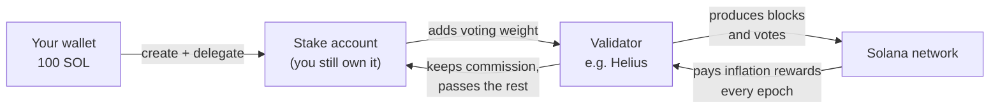
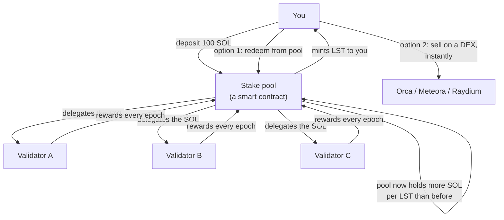
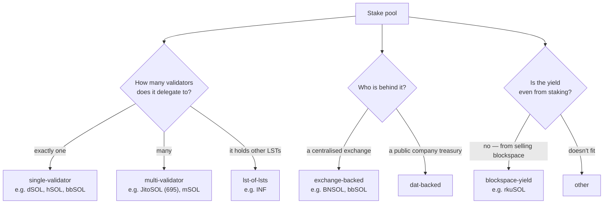
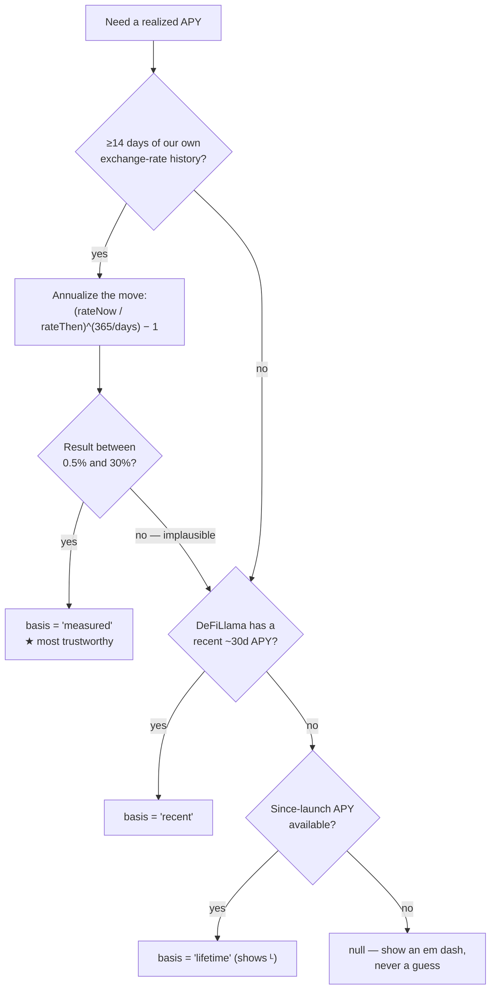
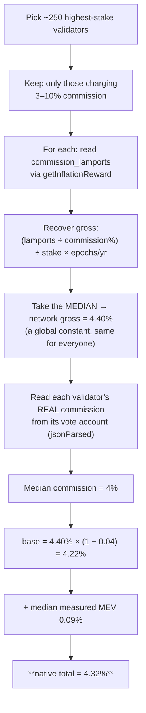
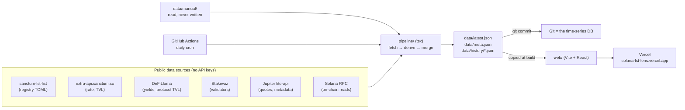
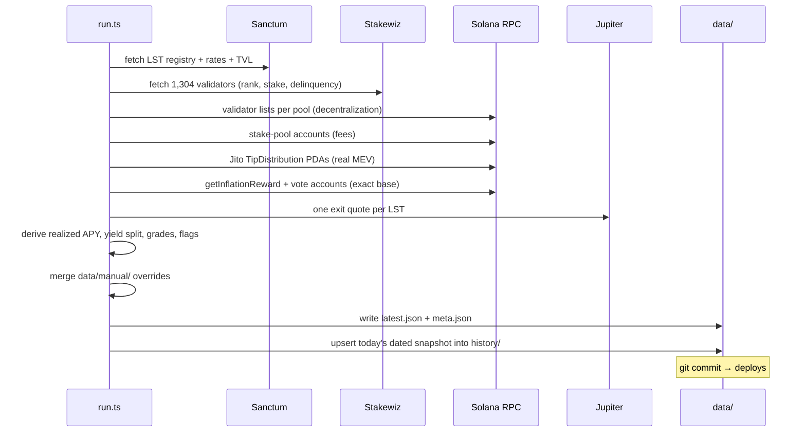
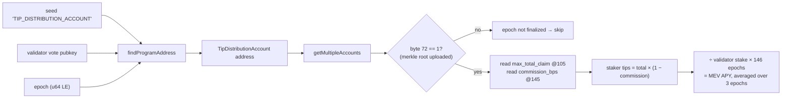

# The Solana LST Guide

**A beginner-to-mastery walkthrough of Liquid Staking Tokens — and of this dashboard.**

You don't need to know anything about Solana, staking, or DeFi to start. Every
term is defined the first time it appears. By the end you should be able to look
at any LST and say, with evidence, whether it is worth holding.

> **Going too fast?** Parts 1–3 below cover a lot of ground quickly. There is a
> companion file — **[`GUIDE-BASICS.md`](./GUIDE-BASICS.md)** — that re-teaches
> exactly that material at a quarter of the speed: every calculation written out
> line by line, analogies for each idea, and a *Check yourself* exercise at the
> end of each chapter. If any of Parts 1–3 doesn't land, read that first and come
> back at Part 4.

Numbers in this guide are real, taken from the dashboard's `data/latest.json`
snapshot of **2026-07-30**. They will drift; the reasoning won't.

---

## Table of contents

1. [Staking on Solana, from zero](#part-1--staking-on-solana-from-zero)
2. [What a Liquid Staking Token actually is](#part-2--what-a-liquid-staking-token-actually-is)
3. [The LST zoo: seven kinds of pool](#part-3--the-lst-zoo-seven-kinds-of-pool)
4. [Where the yield actually comes from](#part-4--where-the-yield-actually-comes-from)
5. [The five questions to ask any LST](#part-5--the-five-questions-to-ask-any-lst)
6. [The dashboard, feature by feature](#part-6--the-dashboard-feature-by-feature)
7. [How the platform is built](#part-7--how-the-platform-is-built)
8. [A full worked example](#part-8--a-full-worked-example)
9. [Limits and honest caveats](#part-9--limits-and-honest-caveats)
10. [Glossary](#part-10--glossary)
11. [Run it yourself](#part-11--run-it-yourself)

---

# Part 1 — Staking on Solana, from zero

## 1.1 Who runs the network

Solana is run by roughly 1,300 independent computers called **validators**. They
take turns producing blocks and they vote on which blocks are valid. For doing
this work honestly, they get paid.

You, holding SOL, can't produce blocks. But you can **delegate** your SOL to a
validator: you point your stake at them, which increases their voting weight and
their share of block production. In return you get a cut of what they earn.

Crucially, **delegating is not lending**. Your SOL never leaves your control. The
validator can't spend it, can't move it, and can't run away with it. All you are
doing is casting a vote for who gets to run the network.



## 1.2 Epochs: Solana's heartbeat

Solana measures time in **epochs**, each about **2–3 days** (this project models
it as 2.5 days, so ~146 epochs per year).

Almost everything that matters happens at an epoch boundary:

- staking rewards are paid out,
- newly delegated stake becomes active ("warmup"),
- undelegated stake becomes withdrawable ("cooldown").

If you delegate mid-epoch, nothing happens until the boundary. If you undelegate,
you wait until the boundary. **This delay is the entire reason LSTs exist.**

## 1.3 Where staking rewards come from

Solana creates new SOL on a schedule — this is **inflation**. That new SOL is
distributed to everyone who has staked, in proportion to their stake.

The inflation rate started around 8% per year and steps down ~15% annually toward
a floor of 1.5%. Right now the dashboard measures the **gross** rate at about
**4.40%** per year. ("Gross" = before anyone takes a cut.)

Two things follow, and beginners miss both:

- **Staking is partly defensive.** If total supply grows ~4.4% a year and you
  don't stake, your slice of the network shrinks. Staking mostly keeps you level;
  it isn't free money.
- **Nearly everyone earns the same base rate.** Inflation is split by stake
  weight, so no validator can pay you meaningfully more base yield than another.
  Differences between LSTs come from *everything else* — commission, MEV, fees.

## 1.4 Commission: the validator's cut

A validator charges a **commission**, a percentage of the rewards flowing through
them. 0% commission means they pass everything to you; 10% means they keep a
tenth.

```
Network gross rate        4.40%
Validator commission       −4%  (the median across high-stake validators)
                        ───────
What you actually earn    4.22%
```

Two validators with identical performance but different commission pay you
different amounts. **Commission is one of the few real levers.**

> **A live example of getting this wrong.** Helius's own staking page currently
> renders validator commission straight from basis points into a percent sign,
> so Figment shows as **"700.00%"** and Kraken as **"1000.00%"** — they mean 7%
> and 10%. This is precisely the class of error this dashboard exists to catch,
> and it is a good reminder that a number on a dashboard is a claim, not a fact.

## 1.5 The catch: your SOL is frozen

Native staking has one big cost that has nothing to do with yield:

- Your staked SOL is **illiquid**. It can't be traded, lent, or used as
  collateral.
- Unstaking takes until the **next epoch boundary** — up to ~3 days.
- Rewards **auto-compound** into the stake account, which is nice, but you cannot
  touch any of it meanwhile.

If SOL drops 20% while you're in cooldown, you watch. If a great opportunity
appears, you miss it. That opportunity cost is the problem LSTs solve.

### Worked example: 100 SOL, staked natively

| | |
|---|---|
| You delegate | 100 SOL |
| Validator commission | 4% |
| Network gross | 4.40% |
| Your base rate | 4.40% × (1 − 0.04) = **4.22%** |
| Plus typical MEV (see Part 4) | ~0.09% |
| **Total** | **≈ 4.32%/yr** |
| After 1 year | ≈ 104.32 SOL |
| Liquidity meanwhile | **none** |
| Time to exit | up to ~3 days |

That **4.32%** is the number this dashboard calls the **native staking
baseline**, and it is the yardstick for everything that follows.

---

# Part 2 — What a Liquid Staking Token actually is

## 2.1 The idea in one sentence

> You give SOL to a pool; the pool stakes it and gives you a **token that
> represents your claim**. You keep earning staking rewards, but you're holding
> something tradable.

That token is a **Liquid Staking Token (LST)**. JitoSOL, mSOL, JupSOL, bSOL and
~70 others are all LSTs.



## 2.2 The key design choice: your balance never changes

There are two ways to pay a holder their yield.

**Rebasing** — your balance grows. You hold 100 tokens, tomorrow 100.012. Simple
to read, but it breaks most DeFi: liquidity pools and lending markets struggle
with balances that change underneath them.

**Exchange rate (what Solana LSTs use)** — your balance stays at 100 forever.
Instead, **each token becomes worth more SOL**. This is the model you must
internalise:

> **Your token count never changes. The exchange rate goes up. That is the
> yield.**

## 2.3 The exchange rate is the whole story

Every LST has an **exchange rate**: how much SOL one token is worth. It's also
called `solValue` or the NAV (net asset value).

Real numbers from the dashboard:

| LST | Exchange rate | Meaning |
|---|---|---|
| JitoSOL | 1.275866 | 1 JitoSOL is worth 1.2759 SOL |
| mSOL | 1.376648 | 1 mSOL is worth 1.3766 SOL |
| INF | 1.407837 | 1 INF is worth 1.4078 SOL |
| BNSOL | 1.110411 | 1 BNSOL is worth 1.1104 SOL |

An LST that launched at 1.0 and now sits at 1.2759 has earned **27.59% in total**
since launch. A newer LST with a lower rate isn't worse — it's younger. **The
rate's level tells you about age; the rate's *slope* tells you about yield.**

```
Exchange rate over time (the shape of every healthy LST)

 1.28 ┤                                   ╭─────
      │                              ╭────╯
 1.20 ┤                        ╭─────╯
      │                  ╭─────╯
 1.10 ┤            ╭─────╯                     slope = your APY
      │      ╭─────╯
 1.00 ┼──────╯
      └──────┬──────┬──────┬──────┬──────┬─────
          launch   +6mo  +12mo  +18mo  +24mo

Only goes up. A DOWNWARD step is an alarm — see 2.5.
```

### Worked example: buying JitoSOL

You have **100 SOL** and the rate is **1.275866**.

```
Tokens you receive = 100 / 1.275866 = 78.38 JitoSOL
```

A year passes at JitoSOL's measured 5.14%:

```
New rate  = 1.275866 × 1.0514      = 1.341455
Your SOL  = 78.38 × 1.341455       = 105.14 SOL
```

You still hold **78.38 JitoSOL** — the same number you started with. You gained
5.14 SOL because the rate moved. And unlike native staking, during that whole
year you could have sold, lent, or LP'd those tokens at any moment.

**This is why the dashboard measures yield from the exchange rate rather than
believing anyone's advertised number.** The rate is on-chain, public, and
impossible to fake.

## 2.4 Two ways out, and they are not the same

| | **Redeem from the pool** | **Sell on a DEX** |
|---|---|---|
| You receive | Exactly rate × tokens | Whatever the market pays |
| Speed | Waits for cooldown (~2–3 days) | Instant |
| Cost | Usually a small pool fee | **Price impact** (slippage) |
| Reliability | Always available | Depends on liquidity depth |

This second row is the one people forget. Selling 10,000 SOL worth of a thin LST
can move the price against you by more than a year of yield. The dashboard's
**Exit** column exists for exactly this.

## 2.5 "Depeg" means two different things — don't confuse them

- **A market discount.** The DEX price sits below the exchange rate. Usually
  temporary: someone wanted out faster than the pool's liquidity allowed. Often
  an arbitrage opportunity, not a catastrophe, because redemption is still at
  full value.
- **The exchange rate itself falls.** This is the serious one. The rate should
  only ever climb, since it's just accumulated rewards. A drop means something
  broke: a validator was slashed, an accounting bug, or a bad withdrawal.

The dashboard's **Depeg event** risk flag detects the second kind, by watching
for a single-step drop greater than 0.3% in the recorded exchange-rate history.

---

# Part 3 — The LST zoo: seven kinds of pool

Not all LSTs are the same shape. The dashboard classifies each into a **type**,
which changes how you should read every other number.



| Type | What it means | Watch out for |
|---|---|---|
| **single-validator** | One validator gets everything | Maximum concentration risk; if that validator underperforms, so do you |
| **multi-validator** | Spread across a set | Spread ≠ decentralised — check *how* it's spread |
| **lst-of-lsts** | Holds other LSTs | Stacked risk: you inherit every underlying pool's risk |
| **exchange-backed** | Run by a CEX | Custodial assumptions; usually few validators |
| **dat-backed** | Backed by a corporate treasury | Yield may be subsidised — check if it's sustainable |
| **blockspace-yield** | Yield from selling blockspace, not staking | Genuinely different risk model; don't compare APYs naively |
| **other** | Doesn't fit | Read the docs |

### Spread is not the same as decentralised

Both of these are "multi-validator". They are nothing alike:

```
JitoSOL — 695 validators, concentration 0.004
  ▏▏▏▏▏▏▏▏▏▏▏▏▏▏▏▏▏▏▏▏▏▏▏▏▏▏▏▏▏▏▏▏▏▏▏▏▏▏▏▏▏▏▏▏▏▏▏▏  (evenly thin)

JupSOL — 6 validators, concentration 0.797
  ████████████████████████████████████▏▏▏▏▏▏▏▏▏▏▏▏  (one dominates)
```

That 0.797 is a **Herfindahl index** — square each validator's share of the
pool's stake and add them up. 0 means perfectly spread, 1 means a single
validator holds everything. JupSOL scores **F** for decentralisation despite
technically having six validators.

---

# Part 4 — Where the yield actually comes from

An LST's headline APY is not one thing. It's a stack, and knowing the layers is
what separates a real evaluation from vibes.

```
JitoSOL's 5.14%, decomposed (real numbers)

  0%        1%        2%        3%        4%        5%   5.14%
  ├─────────┼─────────┼─────────┼─────────┼─────────┼────┤
  ████████████████████████████████████████████░░░░▒▒▒▒▒▒▒
  └──────────── base staking 4.333% ─────────┘└MEV┘└other┘
                                              0.11%  0.697%
```

## 4.1 Base staking — the floor everyone shares

Inflation, minus your validator's commission. About **4.2–4.4%** for everyone.

You cannot get meaningfully more base yield by picking a different LST. Any pool
advertising 8% is not getting it from inflation — it's coming from a layer below,
or from a subsidy, or the number is wrong.

## 4.2 MEV — the real differentiator

**MEV** (Maximal Extractable Value) is profit from *ordering* transactions:
arbitrage between DEXes, liquidations, and so on. Traders pay validators **tips**
to get their transactions placed favourably. Jito, the dominant MEV
infrastructure on Solana, routes those tips through on-chain accounts, and
validators pass a share to their stakers.

MEV is where LSTs genuinely differ, because it depends on *which validators the
pool chose*. In this snapshot: JitoSOL earns **0.110%**, JupSOL **0.055%**,
edgeSOL **0.098%**, BNSOL **0.079%**.

These look tiny, and they are — but they're one of the few honest differences,
and unlike the base rate they are not the same for everyone.

## 4.3 Priority fees and block rewards

Users pay extra to jump the queue when the network is busy. This accrues to
validators, and whether it reaches you depends on the validator and the pool.
Solana governance has changed how these fees are split more than once, so treat
any fixed number you read as possibly out of date.

This dashboard does **not** separate priority fees. They land inside the
**"other"** bucket — which is exactly why "other" is labelled as a residual
rather than dressed up as a precise figure.

## 4.4 The pool's own fee

The pool takes a cut of rewards for operating: JitoSOL **4%**, JupSOL **5%**,
BNSOL **10%**. Note this is a percentage **of rewards**, not of your principal —
a 10% fee on a 4.4% yield costs you ~0.44 percentage points, not 10%.

**Important:** the realized APY shown in the dashboard is already *net* of this
fee, because it's measured from the exchange rate — which only moves after fees
are taken. The fee is displayed separately for transparency, and is **not**
subtracted twice.

## 4.5 The equation

```
                 realized APY
                       │
   ┌───────────────────┼───────────────────┐
   │                   │                   │
base staking          MEV              "other"
(inflation −      (Jito tips,       (priority fees,
 commission)       real, on-chain)    fee-sharing,
                                      subsidies, residual)

  ~4.2–4.4%        0.05–0.15%         whatever's left

and the pool fee is already baked into all of it.
```

**When "other" is large, ask why.** edgeSOL shows base 4.215% + MEV 0.098% +
**other 6.053%**. Six points of unexplained yield is not staking. It might be a
subsidy, a promotional campaign, or an artifact of a short measurement window.
It is the single most important thing to investigate about that LST, and a
dashboard showing only "10.37% APY" would have hidden the entire question.

---

# Part 5 — The five questions to ask any LST

Everything in Part 6 exists to answer one of these.

### Q1 — Is the yield real, or just advertised?

Anyone can put a number on a landing page. Marketed APYs are often the best epoch
ever recorded, or a projection, or gross of fees. The only trustworthy measure is
the **exchange rate over time**, because it's on-chain and reflects what holders
actually received.

### Q2 — Is it better than doing nothing clever?

You could just stake natively for **4.32%** with no smart-contract risk at all.
An LST must beat that to justify its existence. Many barely do.

### Q3 — Can I actually get out?

A 6% yield you can't exit is worth less than a 5% yield you can. Check price
impact at a realistic size, and check that there's more than one venue.

### Q4 — What is this doing to Solana?

Staking is a vote for who runs the network. Pouring stake into the largest
validators makes the network more centralised and more fragile. This is an
externality — it doesn't show up in your APY, but it's real.

### Q5 — What could go wrong?

Smart-contract bugs, validator slashing, delinquency, concentration, unaudited
code, and yields propped up by subsidies that will end.

---

# Part 6 — The dashboard, feature by feature

Each feature below is presented the same way: **what you see**, **how it works
behind the scenes**, **what value it adds**, and **what would happen if it didn't
exist**.

```
┌──────────────────────────────────────────────────────────────────────────┐
│  Solana LST Comparison                        ● Updated 12 mins ago      │
│  measured, not marketed                                                  │
├──────────────────────────────────────────────────────────────────────────┤
│ ┌────────┐┌───────────┐┌────────────┐┌──────────────┐┌────────────────┐  │
│ │Tracked ││Total SOL  ││Median      ││Native staking││Graded for      │  │
│ │  76    ││ 63.30M    ││ 5.58%      ││   4.32%      ││   72 / 76      │  │
│ └────────┘└───────────┘└────────────┘└──────────────┘└────────────────┘  │
│                                                                          │
│ I want the…  [Max yield] [Most decentralized] [Cheapest exit] [Best…]     │
│ Sort by [TVL ▾]   [Search…]   ☐ Hide 43 without yield data               │
├──────────────────────────────────────────────────────────────────────────┤
│ LST      Type      Realized    Net   Yield split   TVL   Depl  Exit  Score│
│ ──────────────────────────────────────────────────────────────────────── │
│ Native   Baseline    4.32%   4.32%  4.22%+0.09%     —     —     —     —   │  ← reference
│ BNSOL    Multi       4.74%   4.71%  ███████▏      10.56M 11.1K 0.031%  F  │
│          ↳ +0.42 pts vs native                                           │
│ JitoSOL  Multi       5.14%   5.14%  ███████▏      10.42M 1.17M 0.000%  B  │
│          ↳ +0.82 pts vs native                                           │
└──────────────────────────────────────────────────────────────────────────┘
```

---

## 6.1 Realized APY (and the basis label)

**What you see.** The headline yield, with a small superscript **`L`** on some
rows and a hover tooltip explaining the timeframe.

**Behind the scenes.** Three sources, tried in strict order of trustworthiness:



The plausibility band matters: a stale exchange rate can annualize to 400%, and
printing that would be worse than printing nothing.

**Value it adds.** You're never comparing a 30-day number against a
since-launch number without knowing it. The basis is attached to the cell.

**Without it.** You'd be reading whatever number each protocol chose to publish,
computed however they liked, over whatever window flattered them most. Every
comparison would be apples to oranges, and you wouldn't know which was which.

---

## 6.2 Native staking baseline ⭐

**What you see.** A metric card reading **4.32%**, a tinted **"Native staking"**
reference row at the top of the table, and under every LST's yield a green or red
delta: **`+0.82 pts vs native`**.

**Behind the scenes.** This is the trickiest measurement in the project, and it's
worth understanding.

The obvious approach — ask the chain what a staker earned — doesn't work.
`getInflationReward` on a validator's vote account returns the **commission** the
validator skimmed, not the staker's reward. And LSTs deliberately delegate to
**0%-commission** validators, where that number is exactly zero. So the direct
route yields nothing for precisely the validators we care about.

The workaround inverts the problem:



Two deliberate choices:

- **Commission is read from the vote account itself**, not from Stakewiz's API.
  They disagree, and the on-chain value is the one that's true.
- **MEV is included in the baseline.** An LST's realized APY already contains its
  MEV. Comparing that against an inflation-only baseline would silently flatter
  every single LST by ~0.1 points. Including it keeps both sides of the
  comparison like-for-like.

**Value it adds.** It reframes the entire question. Without it the dashboard
answers "which LST pays most?" With it, it answers the question you actually
have: **"is any of this worth it versus just staking myself?"**

In this snapshot, 31 of the 33 LSTs with a measured APY beat the baseline — but
BNSOL beats it by only **0.42 points**, which is a thin reward for taking on
smart-contract risk, an F decentralisation grade, and a 10% pool fee.

**Without it.** Every LST would look good, because they'd only be compared to
each other. The worst option in a list of LSTs still looks like "5th best" rather
than "worse than doing nothing." This is the single most common way LST
dashboards mislead, and it's usually not even deliberate — the baseline is just
genuinely hard to measure, so nobody bothers.

---

## 6.3 Yield split bar

**What you see.** A small stacked bar per row — blue base, a slice of MEV, grey
"other" — with a `~` marking it as modeled.

**Behind the scenes.**

```
base   = the LST's exact measured base (stake-weighted across its validators),
         capped at realized so the parts can never exceed the whole
residual = realized − base
MEV    = real on-chain Jito tips, carved out of the residual
other  = residual − MEV
```

The base is genuinely exact per LST: the pipeline reads each validator's real
commission, computes `gross × (1 − commission)` per validator, then
stake-weights across the pool's actual validator set.

**Value it adds.** It converts "8% APY!" into a question with an answer. If base
is 4.2% and other is 3.8%, you know instantly that most of the yield is *not*
staking, and you know to go find out what it is.

**Without it.** Every LST reduces to a single number, and a subsidised 10% looks
strictly better than a sustainable 5.2%. You'd systematically pick the LSTs whose
yield is least durable.

---

## 6.4 Net take-home and exit cost

**What you see.** An **Exit** column (price impact %) and a **Net** column
(realized APY minus that impact).

**Behind the scenes.** The pipeline sizes a swap worth ~1,000 SOL of the token
(`1000 ÷ exchangeRate`, converted to atomic units) and asks Jupiter for a real
routed quote, then reads `priceImpactPct`. Net take-home subtracts that one-time
haircut from the annual yield.

**Value it adds.** It prices the door. edgeSOL's 10.366% becomes **10.206%** once
you account for getting out. Small here — but on thin LSTs it's the difference
between a good and a bad decision.

**Without it.** You'd optimise for headline yield and discover the cost only when
trying to leave, which is the worst possible moment. Note this is also where the
1,000-SOL sample size is a genuine limitation — see Part 9.

---

## 6.5 Decentralization grade

**What you see.** A letter **A–F**, with the raw inputs in the expanded row.

**Behind the scenes.** The pool's validator set is read on-chain (a single vote
account for single-validator pools, the pool's validator list for multi-validator
ones), joined against Stakewiz for network rank and delinquency, then scored:

| Component | Weight | Reasoning |
|---|---|---|
| Validator count (log-scaled, 1→0, 300+→1) | 30% | More validators is better, with diminishing returns |
| 1 − Herfindahl concentration | 40% | *How* stake is spread matters more than how many |
| Average network rank normalised | 30% | Delegating to smaller validators helps the network |

Then: ≥80 → A, ≥65 → B, ≥50 → C, ≥35 → D, else F.

This is explicitly labelled **"our index"** in the UI, and every raw input is
shown so you can disagree with the weighting and still use the data.

**Value it adds.** It surfaces a cost that never appears in your APY. JupSOL pays
well (5.766%) and scores **F** — 6 validators, 0.797 concentration. That's a
real trade-off, and now you can see it and decide.

**Without it.** Yield-chasing would quietly centralise Solana, because the
externality is invisible at the point of decision. Nobody would be choosing that
outcome — they just wouldn't be shown it.

---

## 6.6 Risk flags

**What you see.** A ⚠ next to a symbol; the expanded row lists what's wrong.

**Behind the scenes.** Computed, not curated:

| Flag | Trigger | Severity |
|---|---|---|
| APY overstated | advertised − realized > 1.5 points | high |
| Stake concentrated | Herfindahl > 0.5 | high |
| Delinquent validator | any validator in the set missing votes | high |
| Depeg event | exchange rate fell >0.3% in one step | high |
| Unaudited | no audits recorded in the manual layer | medium |

Depeg detection is only possible **because** the project keeps its own
exchange-rate history — you can't detect a drop without a before.

**Value it adds.** Reading eleven columns for 76 LSTs is work nobody does. A ⚠
draws the eye to the rows that need it.

**Without it.** Problems would be present in the data but effectively invisible.
JitoSOL currently has **11 delinquent validators** in its set — visible in one
glance, easy to miss in a spreadsheet.

---

## 6.7 DeFi deployment

**What you see.** A **Deployed** column in SOL, broken down by protocol when
expanded (JitoSOL: Kamino 1.08M, Save 88.1K).

**Behind the scenes.** DeFiLlama protocol TVL, filtered to tracked LST symbols.

**Value it adds.** A proxy for real integration. An LST accepted as collateral on
Kamino has been reviewed by risk teams with money at stake — that's meaningful
third-party diligence. It also tells you whether you'll be able to *do* anything
with the token.

**Without it.** You couldn't distinguish an LST that DeFi actually trusts from
one that merely exists. The label is honest about double-counting (the same SOL
can be counted once as SOL and once as the LST), so it's presented as an upper
bound.

---

## 6.8 History charts

**What you see.** Expand a row → **History** → two charts with **30D / 90D / 1Y /
All** toggles and a crosshair that reports the value for the day you point at.

**Behind the scenes.** Every pipeline run appends one dated snapshot per series to
`data/history/*.json` and commits it. **Git is the time-series database** — no
server, no hosted DB, and a full audit trail of every value the site has ever
shown.

**Value it adds.** Yield claims become checkable over time, and the trend is
often more informative than the level. A falling rate slope tells you something a
single APY figure never will.

**Without it.** No measured APY at all (it's computed *from* this history), no
depeg detection, no trend — the dashboard would be a snapshot with no memory,
and you'd have to trust every number rather than verify it.

---

## 6.9 Compare tray

**What you see.** Hover a row → a ☆ appears → star up to 4 → **"Compare N"** at
the bottom opens a side-by-side panel across 16 metrics, with the better value
highlighted.

**Behind the scenes.** Pins live in React state, mirrored to `localStorage` and to
the URL as `#compare=JitoSOL,JupSOL,INF`, so a comparison is a shareable link
that opens already expanded. "Best" is marked **only where better is
unambiguous** — higher yield, lower fee, lower exit cost. Ties get no marker, and
rows that are matters of preference (type, issuer, first seen) are never marked
at all.

**Value it adds.** The table sorts by one metric at a time, but choosing an LST
means trading metrics against each other — and your two candidates are usually
forty rows apart. The tray puts them side by side.

It also makes trade-offs impossible to miss. JitoSOL vs JupSOL vs INF: INF wins
realized APY (7.542%) and net-after-exit, JitoSOL wins decentralisation (B vs F),
validator count (695 vs 6), concentration (0.004 vs 0.797) and MEV. There is no
single winner — which is the honest answer, and a sorted list can't express it.

**Without it.** You'd sort by yield, pick the top row, and never see what you
gave up. Every metric beyond the sort key would be decoration.

---

## 6.10 Intent pills, sorting, search, and the no-data toggle

**What you see.** "I want the… **Max yield** / **Most decentralized** / **Cheapest
exit** / **Best take-home**", a Sort-by dropdown, search, and **"Hide 43 without
yield data"**.

**Behind the scenes.** Each pill applies a named sort. Nulls always sink to the
bottom regardless of direction, so missing data can never masquerade as the best
value. Row order is *always* a pure function of the active sort — nothing is ever
pinned or promoted. (The native baseline row sits outside the ranking entirely
and is styled as scaffolding, precisely so this rule still holds: it isn't an
LST and isn't competing.)

Rows with no measured yield are **dimmed rather than hidden** by default, with an
opt-in toggle to remove them.

**Value it adds.** Intent pills translate a goal into a sort without requiring
you to know which column encodes it. Dimming-not-hiding means you can see the
coverage gaps rather than being quietly shown a filtered world.

**Without it.** A raw sortable table assumes you already know what to sort by —
which is exactly what a beginner doesn't. And silent filtering would make 43 real
LSTs vanish with no indication they existed.

---

## 6.11 Freshness indicator

**What you see.** "● Updated 12 mins ago" — relative, with the exact timestamp on
hover.

**Value it adds.** Staleness is a property of the data, so it's stated in words
you can act on. "Updated Jul 25" requires you to know today's date and do
subtraction; "6 days ago" does not, and 6 days is a fact you'd want to know
before trusting an exit-cost quote.

**Without it.** Stale data would look identical to fresh data.

---

## 6.12 Advertised APY and the gap (curated only)

**What you see.** Usually nothing — these columns are hidden.

**Behind the scenes.** There is no keyless, reliable source for what each
protocol *markets*. Rather than scrape landing pages and risk being wrong, the
project reads advertised numbers from a hand-curated file
(`data/manual/advertised-apy.json`). Where none is curated, the columns hide
entirely.

**Value it adds.** This is the project's honesty rule made visible: a column that
would need a guess simply doesn't render. Where a human *has* recorded a marketed
number, the gap appears and the "APY overstated" flag can fire.

**Without this discipline.** The most attention-grabbing feature — "look how much
they're lying!" — would be built on scraped, unverifiable numbers. Being wrong
about that accusation would discredit everything else on the page.

---

# Part 7 — How the platform is built

## 7.1 Architecture



Three properties fall out of this design:

- **Zero recurring cost.** Static site, free data sources, git as the database.
- **Fully auditable.** Every number the site ever showed is in git history.
- **No lock-in.** No hosted database to migrate or lose.

## 7.2 A pipeline run, step by step



## 7.3 Why two RPC providers

A quirk worth knowing if you ever run this yourself:

| Provider | Used for | Why |
|---|---|---|
| **Alchemy** (`SOLANA_RPC_URL`) | Everything: MEV reads, pool fees, validator lists, vote-account commission | Fast, generous free tier |
| **Helius** (`HELIUS_RPC_URL`) | `getInflationReward` **only** | Alchemy's free tier blocks this method (error `-32001`) |
| Public mainnet | Last-resort fallback | Free but heavily rate-limited |

The pipeline probes for an RPC that actually serves `getInflationReward` and
routes only that one call there, capping arrays at 64 addresses because Helius
limits it. With neither key set, the whole thing still runs on the public
endpoint — slower, with partial MEV coverage, and base falls back to a 4.5%
constant.

## 7.4 The rule that shapes everything: graceful degradation

> **One failing source degrades its own field to `null`. The run still
> completes. Nothing is ever fabricated to fill a gap.**

`fetchJson` never throws. Every derived value handles `null` inputs. `meta.json`
records per-source health. In the UI, `null` renders as an em dash — never a
zero, never a plausible-looking guess.

This is why you'll see `—` scattered around: 43 LSTs have no measured yield yet,
3 pools use account layouts the decentralisation reader doesn't parse, and INF
and mSOL fall back to the 4.5% base constant. **Those gaps are the honest
output**, and marking them is the point.

The history writer follows the same spirit: `appendSnapshot` **upserts by date**,
so re-running the pipeline twice in one day replaces today's entry instead of
duplicating it, and never truncates what came before.

## 7.5 Reading MEV off the chain

For each (validator, epoch) pair, Jito derives a **TipDistributionAccount** —
a deterministic address (a PDA) under program `4R3gSG8B…c2r7`:



Those byte offsets come from the Anchor account layout. It's raw, but it means
the MEV figure is read from the chain rather than taken from anyone's API.

---

# Part 8 — A full worked example

**You have 500 SOL. What do you do?**

### Step 1 — Establish the floor

The **Native staking baseline** card reads **4.32%**. Staking yourself, with zero
smart-contract risk, earns ~21.6 SOL a year. Any LST must beat this *enough to
pay for its extra risk*.

### Step 2 — Shortlist

Click **Max yield**. Star three candidates and open the compare tray:

| | **JitoSOL** | **JupSOL** | **INF** |
|---|---|---|---|
| Realized APY | 5.14% | 5.766% | **7.542%** |
| vs native | +0.82 pts | +1.45 pts | **+3.22 pts** |
| Net after exit | 5.14% | 5.766% | **7.542%** |
| Base staking | 4.333% | 4.18% | 4.50% |
| MEV | **0.110%** | 0.055% | — |
| Protocol fee | **4.00%** | 5.00% | — |
| Exit price impact | 0.000% | 0.000% | 0.000% |
| Decentralization | **B** | F | — |
| Validators | **695** | 6 | — |
| Stake concentration | **0.004** | 0.797 | — |
| Risk flags | Delinquent validator | Stake concentrated | **None** |
| Type | multi-validator | multi-validator | lst-of-lsts |

### Step 3 — Interrogate the leader

INF's 7.542% is the biggest number, so it deserves the most scepticism.

- Its basis is **`lifetime`** (the ᴸ marker) — annualised since launch, not a
  recent 30-day figure. It describes the past, possibly a very different past.
- Its yield split is base 4.50% + **other 3.042%**, and the base is the **4.5%
  fallback constant**, not a measured value — INF's account layout isn't one the
  exact-base reader parses. So its yield split is softer than it looks.
- Its decentralisation grade is **—**, not A. As an **lst-of-lsts** it holds other
  LSTs, so it inherits their validator sets and their risks; the grade isn't
  missing by accident, it's structurally harder to compute.
- Three points of unexplained "other" is the thing to research before investing.

### Step 4 — Read the trade-off honestly

- **INF**: highest yield, but the least *explained* yield and no decentralisation
  grade.
- **JupSOL**: +1.45 pts over native, but 6 validators at 0.797 concentration —
  you're paying for yield with centralisation, and carrying a high-severity flag.
- **JitoSOL**: the smallest premium (+0.82 pts), the best-understood yield (real
  measured MEV, exact base), the lowest fee, an excellent decentralisation
  profile, and deep DeFi integration. It does carry a delinquent-validator flag —
  though with 695 validators, 11 delinquent is a small fraction.

### Step 5 — Decide

There's no single right answer, and the dashboard deliberately doesn't pick one.
What it does is make the trade explicit: **INF pays ~2.4 points more than
JitoSOL, and in exchange you accept an unexplained yield source, a lifetime-basis
number, and no decentralisation grade.** If that trade is worth it to you, take
it knowingly. That's the whole product.

---

# Part 9 — Limits and honest caveats

A tool that hides its weaknesses can't be trusted about its strengths.

| Limitation | Why | Impact |
|---|---|---|
| **Exit cost is one 1,000-SOL quote** | Simplicity | Doesn't tell you depth. A 10,000-SOL exit could be far worse. *The known next improvement: quote 100 / 1k / 10k for a real slippage curve.* |
| **History is shallow** | The project started recently | Most rows fall back to `recent`/`lifetime` basis; only 33 of 76 have any measured yield. Deepens daily. |
| **Advertised APY is manual** | No keyless source | The gap columns stay hidden until curated |
| **4 LSTs ungraded** | Marinade/Lido/SPool and rkuSOL use account layouts the validator-set reader doesn't parse | INF, stSOL, mSOL and rkuSOL show `—` for decentralisation |
| **INF and mSOL use the 4.5% base fallback** | Same layout problem | Their yield split is less exact than others' |
| **Priority fees not separated** | Hard to attribute | They sit inside "other" |
| **Holders always `—`** | No public source | Column is empty by design |
| **Launch date = "first seen on Jupiter"** | Proxy | Accurate for LSTs listed since ~2024, lags for older ones |
| **Daily refresh** | Free cron | Helius's page updates every ~14 minutes; this doesn't |
| **Decentralization grade is editorial** | The weights are a judgement call | Labelled "our index", with every raw input shown so you can disagree |

---

# Part 10 — Glossary

| Term | Meaning |
|---|---|
| **APY** | Annual Percentage Yield — return over a year, compounding included |
| **Basis** | *Which* timeframe an APY was computed over (`measured` / `recent` / `lifetime`) |
| **Basis point (bp)** | 1/100th of a percent. 700 bps = 7% |
| **Commission** | The validator's cut of rewards |
| **Delinquent** | A validator that has stopped voting reliably |
| **Depeg** | Either a market price below NAV, or a fall in the exchange rate itself |
| **Epoch** | Solana's ~2–3 day reward cycle |
| **Exchange rate / `solValue` / NAV** | How much SOL one LST token is worth |
| **Herfindahl index** | Concentration measure; 0 = spread evenly, 1 = one holder has everything |
| **Inflation** | New SOL issued by the protocol and paid to stakers |
| **LST** | Liquid Staking Token |
| **MEV** | Maximal Extractable Value — profit from transaction ordering |
| **PDA** | Program Derived Address — a deterministic on-chain address |
| **Percentage point (pt)** | The difference between two percentages. 5.14% − 4.32% = 0.82 **pts** |
| **Price impact / slippage** | How much a trade moves the price against you |
| **Realized APY** | Yield actually delivered, measured from the exchange rate |
| **RPC** | The API you use to read the blockchain |
| **Stake pool** | The smart contract behind an LST |
| **TVL** | Total Value Locked |
| **Validator** | A computer that produces and votes on blocks |
| **Vote account** | The on-chain account identifying a validator |

---

# Part 11 — Run it yourself

```bash
pnpm install
pnpm pipeline            # fetch live data → data/latest.json (+ history)
pnpm prepare-web-data    # copy data/ → web/public/data/
pnpm dev                 # http://localhost:5173
```

Optional but recommended: a `.env` with `SOLANA_RPC_URL` (Alchemy) and
`HELIUS_RPC_URL` (Helius). Without them the pipeline still runs on the public
endpoint — slower, with partial MEV coverage.

Things to try:

- `http://localhost:5173/#lst=JitoSOL` — deep-link an expanded row
- `http://localhost:5173/#compare=JitoSOL,JupSOL,INF` — a shareable comparison
- `data/meta.json` — per-source health for the last run
- `git log -p data/history/exchange-rates.json` — every rate ever recorded

Further reading in this repo: **`PROGRESS.md`** (current state), **`NOTES.md`**
(the deeper "why"), **`DEVELOPMENT_PLAN.md`** (the original spec).

---

*Measured, not marketed.*
